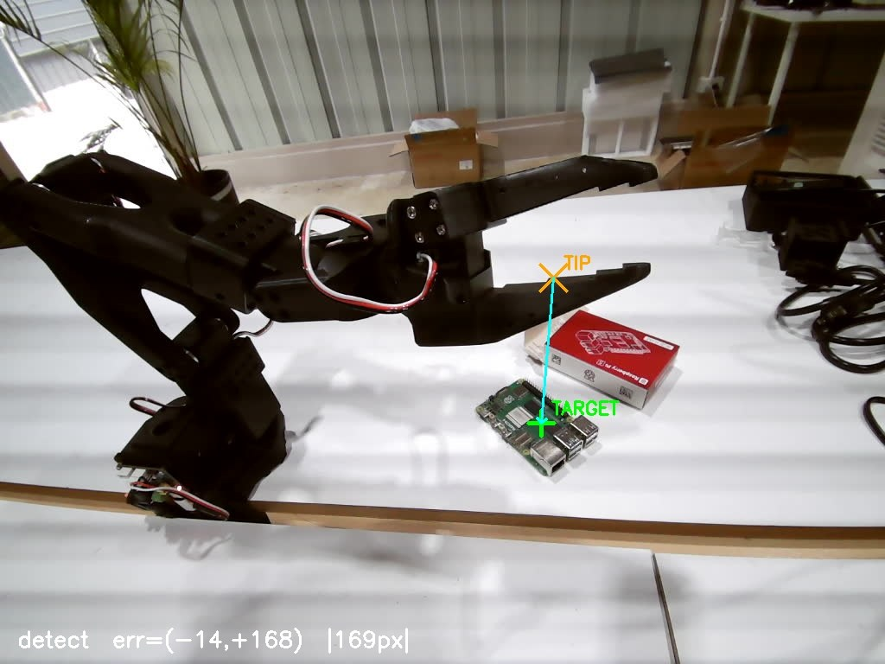

# robobench

Uncalibrated visual servoing for the **SO-101 follower arm** running on a
daslab Pi node. Drives the gripper to hover over a target object using a
**single uncalibrated camera** and a **probe-learned image Jacobian**.
No URDF, no IK solver, no camera intrinsics required.

Built against `pi5b-node.daslab.dev` and the `/api/robot/{state,command}`
HTTP API exposed by the daslab Pi node.


> SO-101 servoing onto a Raspberry Pi PCB. **iter 0**: 118 px error.
> **iter 6**: gripper jaws straddle the Pi (target occluded → loop exits).

---

## How it works

1. **Detect** — find a `target` blob and the `gripper tip` pixel in a frame
   pulled from the node's MJPEG stream (`/api/stream`).
2. **Probe** — gently jog `shoulder_pan`, `shoulder_lift`, `elbow_flex`
   ±Δ° around the start pose. Measure how the gripper-tip pixel moves.
   Build a 2×3 image Jacobian `J ∈ ℝ²ˣ³` (px / deg).
3. **Servo** — closed loop:
   ```
   err = target_px − tip_px
   Δq  = α · J⁺ · err
   ```
   send Δq, settle, re-detect, repeat until `|err| < tol_px`.

The Jacobian only needs to be roughly correct — the closed loop forgives
modeling error.

### Detector demo

Single frame, `python -m robobench.detect <image>`:



`TARGET` is the green Pi PCB centroid; `TIP` is the gripper tip pixel
extrapolated forward along the arm's principal axis from the red wire bundle.

### What moved (start pose vs final pose)


Red pixels = where the scene changed between iter 0 and iter 6.
The gripper swept right and slightly down to reach over the Pi; the rest of
the frame is static (table, room, cables) so it stays grey.


Same data, anaglyph style: the **start pose is cyan**, the **final pose is
red**. Stationary parts overlap into grey.

---

## Detectors (current)

The included detectors are tuned for this scene:

- **Pi PCB** (`detect_target`): largest green HSV blob.
- **Gripper tip** (`detect_grip_tip`): red wire bundle on the gripper, then
  PCA over the dark arm pixels around it to extrapolate forward along the
  arm axis.

Both live in `robobench/detect.py` — swap them for your own object as needed.
The rest of the pipeline is detector-agnostic.

---

## Quick start

```bash
pip install -r requirements.txt

# 1. recon — verify the detector finds your target & the tip
python -m robobench.detect path/to/snapshot.jpg --out /tmp/detect.jpg

# 2. probe — learn the image Jacobian (≈25 s, joint travel ±1.5°)
python -m robobench.probe --node https://pi5b-node.daslab.dev \
                          --delta 1.5 --out /tmp/jacobian.json

# 3. servo — drive tip onto target (≈30–60 s)
python -m robobench.servo --node https://pi5b-node.daslab.dev \
                          --jacobian /tmp/jacobian.json \
                          --max-iters 8 --tol 15 --gain 0.45 \
                          --max-step 2.5 --out /tmp/servo

# 4. one-shot — probe + servo end-to-end
python -m robobench.run  --node https://pi5b-node.daslab.dev --out /tmp/run
```

Each step writes annotated frames + JSON history so you can inspect what
happened.

---

## Demo result

Servoing the SO-101 gripper over a Raspberry Pi PCB on a white table:

| iter | \|err\| px | pan° | lift° | elbow° |
|---:|---:|---:|---:|---:|
| 0  | 118 | 94.3 | −28.3 | 40.2 |
| 1  |  98 | 95.8 | −27.6 | 40.4 |
| 2  |  83 | 97.3 | −27.0 | 40.6 |
| 3  |  79 | 98.8 | −26.5 | 40.7 |
| 4  |  75 | 100.3| −26.1 | 40.8 |
| 5  |  71 | 101.8| −25.8 | 40.8 |
| 6  | (Pi between gripper jaws — occluded) | 99.8 | −25.3 | 41.3 |

Total joint travel: 7° pan, 5° lift, 3° elbow. Tip moved from ~250 px off
target to physically straddling the Pi. Pixel-error decay was monotonic
and capped only because the per-iteration step was clamped to ±1.5°/iter
during the demo run — raise `--max-step` to 3°+ to converge in 3–4 iters.


---

## Safety

Every joint command is clamped to `LIMITS` in `robobench/config.py`. The
servo loop also caps:

- per-iteration step (`--max-step` deg)
- cumulative travel from start pose (`--max-travel` deg)
- total iterations (`--max-iters`)

Out-of-bounds commands are clipped. Detection failure aborts the loop and
leaves the arm where it is (it does **not** auto-return home — you do that
yourself).

---

## API surface (pi5b-node)

- `GET  /api/robot/state` → `{ positions: { "<joint>.pos": deg } }`
- `POST /api/robot/command` body `{ "joint": "<joint>.pos", "value": deg }`
- `GET  /api/stream?device=/dev/videoX&width=W&height=H&fps=N` (MJPEG)
- `GET  /api/status` (teleop / cameras / arms)
- `GET  /api/cameras` (camera list)

---

## Repo layout

```
robobench/
├── README.md
├── requirements.txt
├── docs/
│   ├── servo_trajectory.jpg     # 7-frame trajectory strip
│   ├── servo_before_after.jpg   # iter 0 vs iter 6
│   ├── servo_diff_heat.jpg      # red-mask motion overlay
│   ├── servo_diff_anaglyph.jpg  # cyan/red anaglyph
│   └── detect_demo.jpg          # detector visualization
├── examples/
│   ├── snapshot_demo.jpg
│   └── snapshot_demo.annotated.jpg
└── robobench/
    ├── __init__.py
    ├── config.py        # joint limits, default URLs
    ├── client.py        # node HTTP client (state / command / mjpeg snap)
    ├── detect.py        # target + gripper-tip detectors
    ├── probe.py         # builds the image Jacobian
    ├── servo.py         # closed-loop visual servo
    └── run.py           # probe → servo end-to-end
```

## License

MIT
