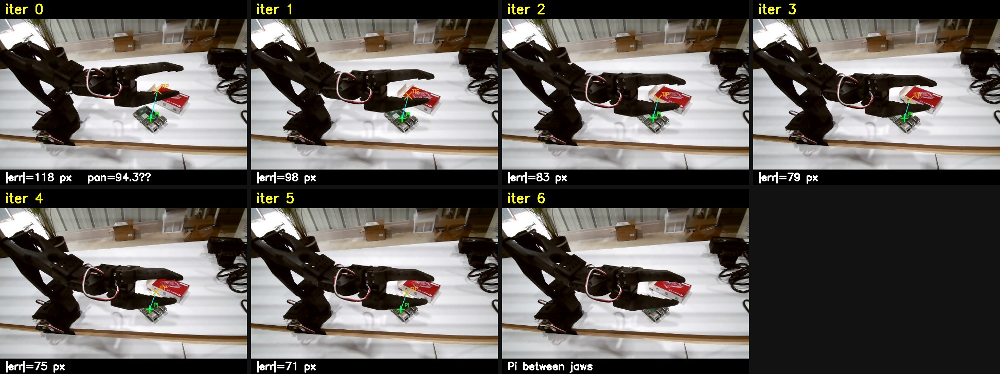
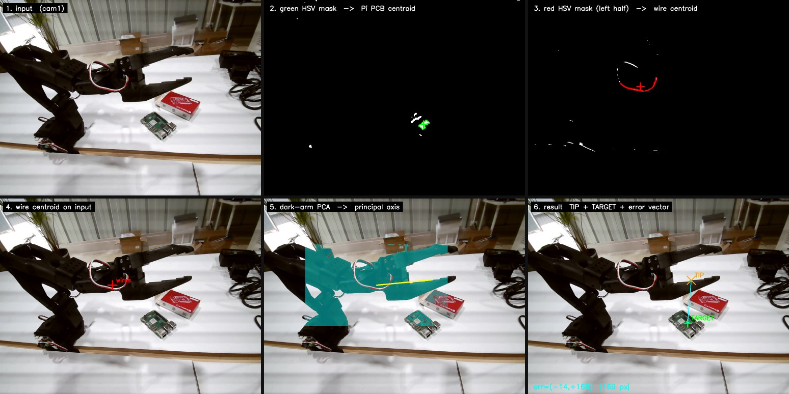
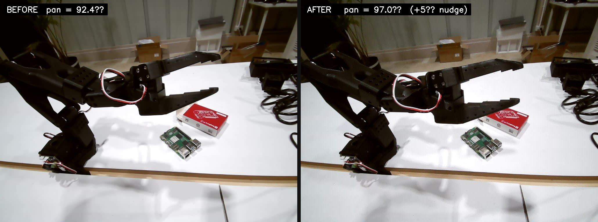
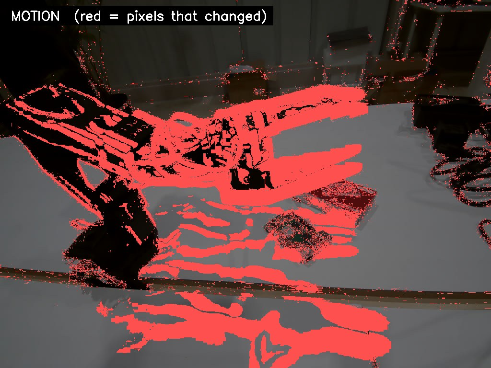
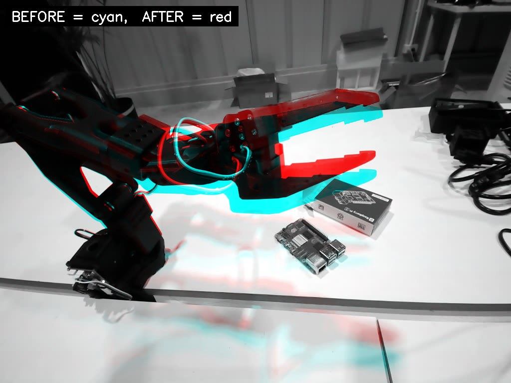

# robobench

Uncalibrated visual servoing for the **SO-101 follower arm** running on a
daslab Pi node. Drives the gripper to hover over a target object using a
**single uncalibrated camera** and a **probe-learned image Jacobian**.
No URDF, no IK solver, no camera intrinsics required.

Built against `pi5b-node.daslab.dev` and the `/api/robot/{state,command}`
HTTP API exposed by the daslab Pi node.



> SO-101 servoing onto a Raspberry Pi PCB. **iter 0**: 118 px error.
> **iter 6**: gripper jaws straddle the Pi (target occluded → loop exits).

For a deeper walkthrough see [`docs/HOW_IT_WORKS.md`](docs/HOW_IT_WORKS.md).

---

## How it works

1. **Detect** — find a `target` blob and the `gripper tip` pixel in a frame
   pulled from the node's MJPEG stream (`/api/stream`).
2. **Probe** — gently jog `shoulder_pan`, `shoulder_lift`, `elbow_flex`
   ±Δ° around the start pose. Measure how the gripper-tip pixel moves.
   Build a 2×3 image Jacobian `J ∈ ℝ²ˣ³` (px / deg).
3. **Servo** — closed loop:
   ```
   err = target_px − tip_px
   Δq  = α · J⁺ · err
   ```
   send Δq, settle, re-detect, repeat until `|err| < tol_px`.

The Jacobian only needs to be roughly correct — the closed loop forgives
modeling error.

---

## Detection pipeline

The detectors live in `robobench/detect.py`. The full 6-stage pipeline can
be visualized for any frame with `scripts/visualize_detection.py`:



| step | what it does |
|---|---|
| **1. input** | one JPEG snapped from `/api/stream` |
| **2. green HSV mask** | `inRange((35,60,30),(85,255,200))` + open/close → largest contour → **TARGET** |
| **3. red HSV mask** | wraparound red `(0..10) ∪ (170..180)` + close, right 45 % suppressed (so the red Pi *box* doesn't outvote the red wires) → wires centroid |
| **4. wires centroid** | wires marker projected back on the input |
| **5. dark-arm PCA** | mask `gray ≤ 70` in a band around the wires; PCA → arm principal axis |
| **6. result** | extrapolate 200 px along that axis from the wires → **TIP**; draw error vector |

Steps 5–6 are the trick: they convert "I know where the wires are" into
"I know where the fingertips are" without any URDF or kinematics.

For a different scene only step 2 (target) and possibly step 3 (gripper)
need new colour ranges. Steps 5–6 are scene-agnostic.

```bash
# Recon a single frame
python -m robobench.detect path/to/frame.jpg --out /tmp/detect.jpg

# Generate the full 6-panel pipeline view
python scripts/visualize_detection.py path/to/frame.jpg --out docs/detection
```

---

## Quick start

```bash
pip install -r requirements.txt

# 1. recon — verify the detector finds your target & the tip
python -m robobench.detect path/to/snapshot.jpg --out /tmp/detect.jpg

# 2. probe — learn the image Jacobian (≈25 s, joint travel ±1.5°)
python -m robobench.probe --node https://pi5b-node.daslab.dev \
                          --delta 1.5 --out /tmp/probe

# 3. servo — drive tip onto target (≈30–60 s)
python -m robobench.servo --node https://pi5b-node.daslab.dev \
                          --jacobian /tmp/probe/jacobian.json \
                          --max-iters 8 --tol 15 --gain 0.45 \
                          --max-step 2.5 --out /tmp/servo

# 4. one-shot — probe + servo end-to-end
python -m robobench.run  --node https://pi5b-node.daslab.dev --out /tmp/run
```

Each step writes annotated frames + JSON history so you can inspect what
happened.

---

## Demo result

Servoing the SO-101 gripper over a Raspberry Pi PCB on a white table:

| iter | \|err\| px | pan° | lift° | elbow° |
|---:|---:|---:|---:|---:|
| 0  | 118 | 94.3  | −28.3 | 40.2 |
| 1  |  98 | 95.8  | −27.6 | 40.4 |
| 2  |  83 | 97.3  | −27.0 | 40.6 |
| 3  |  79 | 98.8  | −26.5 | 40.7 |
| 4  |  75 | 100.3 | −26.1 | 40.8 |
| 5  |  71 | 101.8 | −25.8 | 40.8 |
| 6  | (Pi between gripper jaws — occluded) | 99.8 | −25.3 | 41.3 |

Total joint travel: 7° pan, 5° lift, 3° elbow. Tip moved from ~250 px off
target to physically straddling the Pi. Pixel-error decay was monotonic
and capped only because the per-iteration step was clamped to ±1.5°/iter
during the demo run — raise `--max-step` to 3°+ to converge in 3–4 iters.



### What moved

A clean motion overlay produced from a +5° `shoulder_pan` nudge — the
arm is the only thing that moved, so red highlights *exactly* the swept
volume of the gripper (the rest of the scene stays grey):



…and as a cyan/red anaglyph (start = cyan, end = red, static parts
overlap into grey):



Both produced by `scripts/make_diff_images.py`:

```bash
python scripts/make_diff_images.py BEFORE.jpg AFTER.jpg \
    --out docs --prefix servo \
    --label-before "BEFORE  pan = 92.4°" \
    --label-after  "AFTER   pan = 97.0°  (+5° nudge)"
```

The heat function blurs both inputs, thresholds the per-pixel max-channel
delta, then opens/closes the mask and drops connected components below
80 px to suppress JPEG / sensor / MJPEG-tear noise.

The trajectory grid above is built the same way:

```bash
python scripts/make_trajectory_strip.py /tmp/servo \
    --out docs/servo_trajectory.jpg
```

---

## Safety

Every joint command is clamped to `LIMITS` in `robobench/config.py`. The
servo loop also caps:

- per-iteration step (`--max-step` deg)
- cumulative travel from start pose (`--max-travel` deg)
- total iterations (`--max-iters`)

Out-of-bounds commands are clipped. Detection failure aborts the loop and
leaves the arm where it is (it does **not** auto-return home — you do that
yourself).

---

## API surface (pi5b-node)

- `GET  /api/robot/state` → `{ positions: { "<joint>.pos": deg } }`
- `POST /api/robot/command` body `{ "joint": "<joint>.pos", "value": deg }`
- `GET  /api/stream?device=/dev/videoX&width=W&height=H&fps=N` (MJPEG)
- `GET  /api/status` (teleop / cameras / arms)
- `GET  /api/cameras` (camera list)

---

## Repo layout

```
robobench/
├── README.md
├── requirements.txt
├── robobench/                       # the library
│   ├── __init__.py
│   ├── config.py                    # JOINTS, LIMITS, DEFAULT_NODE
│   ├── client.py                    # NodeClient: state(), command(), snap_jpeg()
│   ├── detect.py                    # detect_target, detect_grip_tip, annotate
│   ├── probe.py                     # probe-learn the 2x3 Jacobian
│   ├── servo.py                     # closed-loop visual servo
│   └── run.py                       # probe + servo end-to-end
├── scripts/                         # docs / debug utilities (NOT runtime deps)
│   ├── visualize_detection.py       # 6-panel detection pipeline
│   ├── make_trajectory_strip.py     # iter*.jpg → tiled grid
│   └── make_diff_images.py          # heat / anaglyph / before-after
├── examples/
│   ├── snapshot_demo.jpg
│   └── snapshot_demo.annotated.jpg
└── docs/
    ├── HOW_IT_WORKS.md              # full walkthrough
    ├── servo_trajectory.jpg         # 7-frame trajectory strip
    ├── servo_before_after.jpg       # iter 0 vs iter 6
    ├── servo_diff_heat.jpg          # motion mask
    ├── servo_diff_anaglyph.jpg      # cyan/red anaglyph
    ├── detect_demo.jpg              # detector single-frame demo
    └── detection/                   # 6-stage pipeline panels + grid
        ├── 01_input.jpg
        ├── 02_green_mask.jpg
        ├── 03_red_mask.jpg
        ├── 04_wires.jpg
        ├── 05_pca_axis.jpg
        ├── 06_final.jpg
        └── detection_grid.jpg
```

## License

MIT
